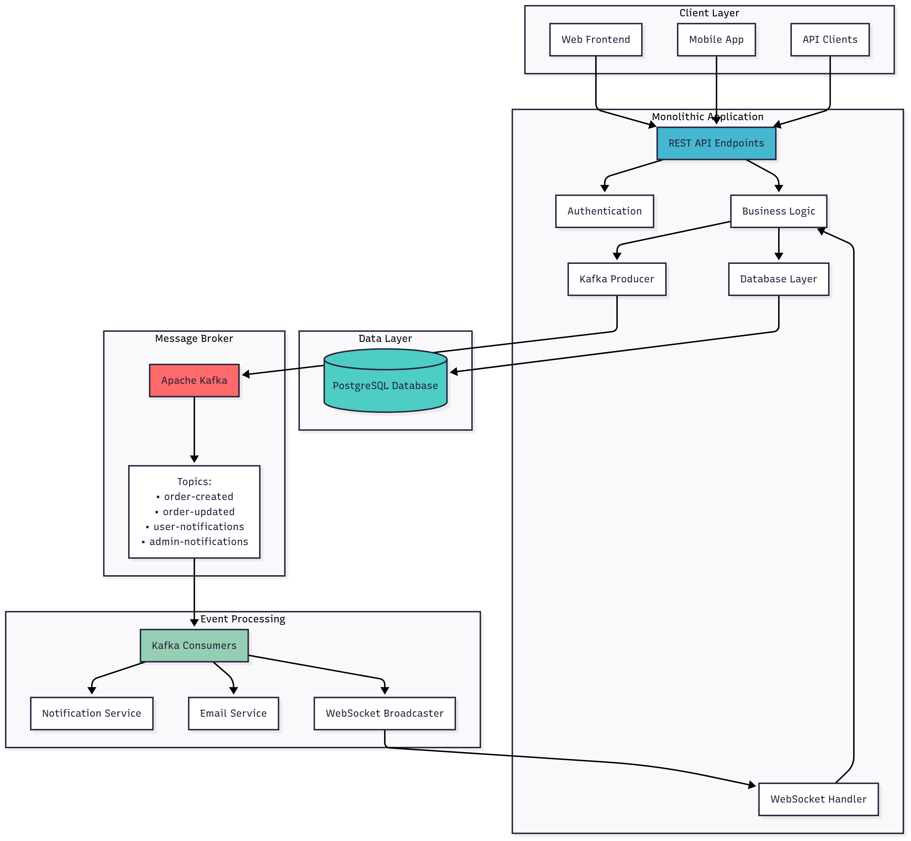
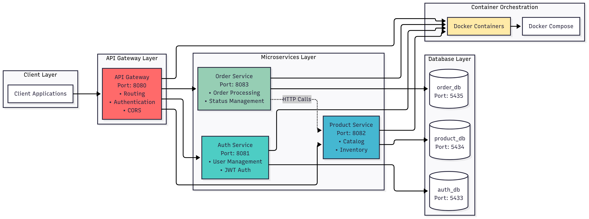
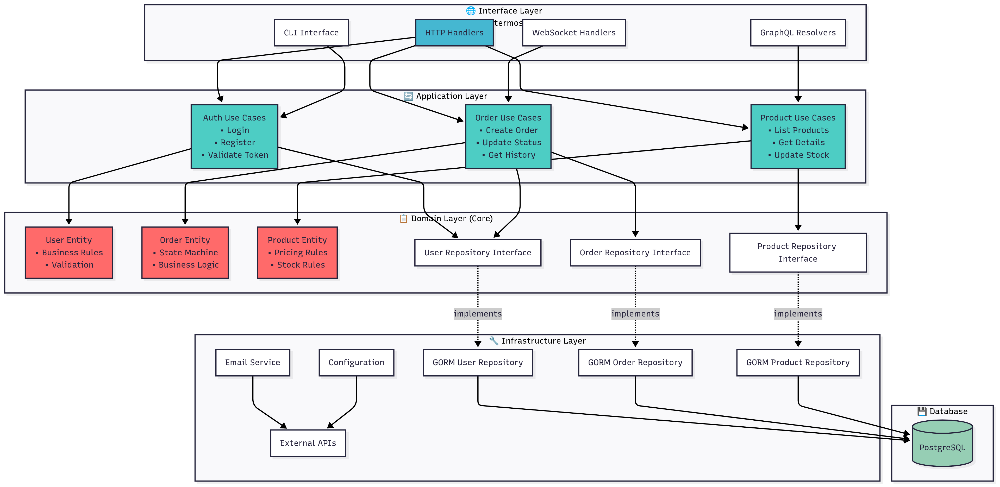
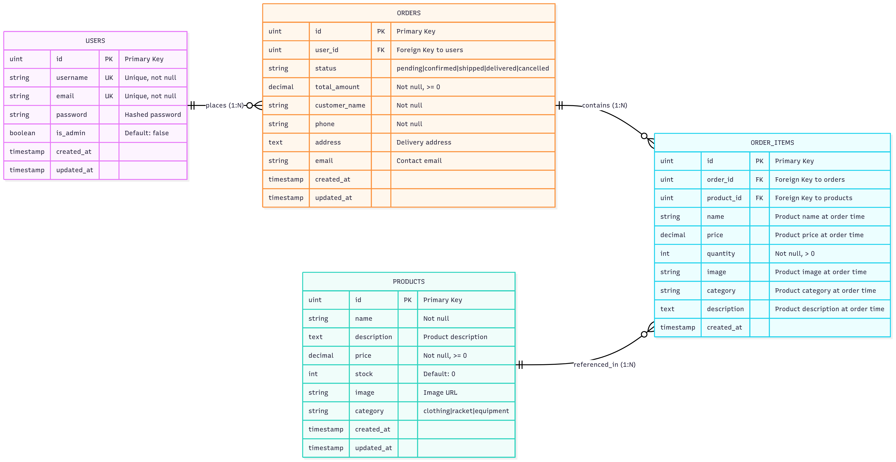

# 🏸 ShopCauLongBE - E-commerce Architecture Showcase

**Hệ thống backend cho shop bán đồ cầu lông được implement với 3 kiến trúc khác nhau**

[](https://golang.org/)
[](.)
[](LICENSE)

---

## 🎯 **Giới thiệu**

**ShopCauLongBE** là một dự án demonstrative cho thấy cách implement cùng một business domain (e-commerce shop cầu lông) với **3 kiến trúc software khác nhau**. Mỗi branch thể hiện một approach khác nhau về system design, từ đơn giản đến phức tạp, từ monolith đến distributed systems.

**Business Domain:** Shop bán đồ cầu lông với các chức năng:
- 👤 User management (Registration, Authentication)  
- 📦 Product catalog (Áo, quần, vợt, phụ kiện cầu lông)
- 🛒 Order management (Đặt hàng, tracking, status updates)
- 👨‍💼 Admin dashboard (Quản lý đơn hàng, sản phẩm)
- 🔔 Real-time notifications

---

## 🏗️ **3 Architecture Implementations**

### 📂 **Branch: `kafka`** - Event-Driven Monolith
> **Kiến trúc:** Monolithic + Event-Driven với Apache Kafka



**🔧 Tech Stack:**
- **Backend**: Go + Gin framework
- **Database**: PostgreSQL + GORM
- **Message Broker**: Apache Kafka (segmentio/kafka-go)
- **Real-time**: WebSocket for live updates
- **Authentication**: JWT tokens

**✅ Ưu điểm:**
- **Simple deployment**: Một application duy nhất
- **Fast development**: Shared codebase, easy debugging
- **Event-driven**: Asynchronous processing với Kafka
- **Real-time**: WebSocket notifications
- **ACID transactions**: Database consistency

**⚠️ Trade-offs:**
- **Single point of failure**: Toàn bộ app down nếu có lỗi
- **Scaling limitations**: Phải scale cả app, không thể scale từng component
- **Technology constraints**: Stuck với một tech stack

**🎯 Khi nào dùng:**
- Startup/MVP development
- Team nhỏ (1-5 developers)
- Requirements chưa rõ ràng
- Cần ship product nhanh

---

### 🔧 **Branch: `microservices`** - Microservices Architecture
> **Kiến trúc:** Distributed Microservices với API Gateway



**🔧 Tech Stack:**
- **API Gateway**: Request routing, authentication middleware
- **Services**: Auth, Product, Order services (độc lập)
- **Databases**: Database per service pattern
- **Communication**: HTTP REST APIs
- **Containerization**: Docker containers

**✅ Ưu điểm:**
- **Independent scaling**: Scale từng service theo nhu cầu
- **Technology diversity**: Mỗi service có thể dùng tech khác nhau
- **Fault isolation**: Lỗi một service không crash toàn bộ
- **Team autonomy**: Teams có thể develop/deploy độc lập
- **Database per service**: Data ownership và independence

**⚠️ Trade-offs:**
- **Network complexity**: Service-to-service communication
- **Distributed transactions**: Data consistency challenges
- **Deployment complexity**: Multiple services management
- **Monitoring overhead**: Distributed tracing, logging

**🎯 Khi nào dùng:**
- Large scale applications
- Multiple development teams
- Clear domain boundaries
- High scalability requirements

---

### 🏛️ **Branch: `clean-architecture`** - Clean Architecture (DDD)
> **Kiến trúc:** Domain Driven Design + Clean Architecture



**🔧 Architecture Layers:**
- **Domain**: Business entities, rules, pure business logic
- **Application**: Use cases, business workflows, orchestration  
- **Infrastructure**: Database, external services, configuration
- **Interface**: HTTP, WebSocket, CLI interfaces

**✅ Ưu điểm:**
- **Business focus**: Domain logic là trung tâm
- **Testability**: Business logic độc lập, dễ unit test
- **Maintainability**: Clear separation of concerns
- **Framework independence**: Không bị lock với framework
- **Database independence**: Repository pattern

**⚠️ Trade-offs:**
- **Learning curve**: Cần hiểu DDD concepts
- **Boilerplate code**: Nhiều interfaces và abstractions
- **Over-engineering**: Có thể phức tạp cho simple apps
- **Development time**: Slower initial development

**🎯 Khi nào dùng:**
- Complex business domains
- Long-term maintenance
- Large development teams
- Enterprise applications

---

## 🗄️ **Database & Data Relations**

### **Entity Relationship Diagram**
> **Mô tả:** Data model và relationships giữa các entities trong hệ thống



### **Core Entities**
- **👤 Users**: Customer accounts và authentication data
- **📦 Products**: Cầu lông equipment catalog (rackets, shuttlecocks, apparel)  
- **📂 Categories**: Product categorization và hierarchy
- **🛒 Orders**: Purchase orders với status tracking
- **📋 Order_Items**: Individual items trong mỗi order
- **🔔 Notifications**: Real-time user notifications

### **Key Relationships**
- **User → Orders**: One-to-Many (một user có nhiều orders)
- **Order → Order_Items**: One-to-Many (một order chứa nhiều items)
- **Product → Order_Items**: One-to-Many (một product có thể trong nhiều orders)
- **Category → Products**: One-to-Many (một category chứa nhiều products)
- **User → Notifications**: One-to-Many (một user nhận nhiều notifications)

### **Database Strategies by Architecture**
- **🗄️ Monolithic**: Shared database với ACID transactions
- **🔧 Microservices**: Database per service pattern
- **🏛️ Clean Architecture**: Repository pattern với domain entities

---

## 📊 **Architecture Comparison**

| Aspect | Monolithic + Kafka | Microservices | Clean Architecture |
|--------|-------------------|---------------|-------------------|
| **Complexity** | 🟢 Low | 🟡 Medium | 🔴 High |
| **Scalability** | 🟡 Vertical only | 🟢 Horizontal | 🟡 Depends on deployment |
| **Development Speed** | 🟢 Fast | 🟡 Medium | 🔴 Slow initially |
| **Testing** | 🟡 Integration heavy | 🟡 Service testing | 🟢 Unit test friendly |
| **Deployment** | 🟢 Simple | 🔴 Complex | 🟡 Moderate |
| **Team Size** | 🟢 1-5 people | 🟢 5-50 people | 🟡 Any size |
| **Maintenance** | 🟡 Medium | 🔴 High overhead | 🟢 Low coupling |
| **Business Logic** | 🟡 Mixed concerns | 🟡 Distributed | 🟢 Clear separation |

---

## 🚀 **Getting Started**

### Quick Start
```bash
# Clone repository
git clone https://github.com/kietnguyen2003/ShopCauLongBE.git
cd ShopCauLongBE

# Explore each architecture
git checkout kafka    # Event-driven monolith
git checkout microservices       # Microservices pattern  
git checkout ddd+clean  # Clean arch + DDD

# Each branch has its own README with setup instructions
```

### Architecture Deep Dive
1. **Start with `kafka`** - Đơn giản nhất, dễ hiểu
2. **Move to `microservices`** - Hiểu distributed systems
3. **Study `ddd+clean`** - Advanced design patterns

---

## 🎯 **Learning Outcomes**

Sau khi explore cả 3 branches, bạn sẽ hiểu:

### **Technical Skills**
- ✅ **Event-driven architecture** với Apache Kafka
- ✅ **Microservices patterns** và service communication
- ✅ **Clean Architecture principles** và DDD
- ✅ **Database design patterns** (shared vs per-service)
- ✅ **API design** và service boundaries
- ✅ **Authentication** strategies (JWT, service auth)

### **Architectural Decision Making**
- ✅ **Trade-offs analysis** giữa các patterns
- ✅ **Scaling strategies** cho từng approach
- ✅ **Team organization** impact lên architecture choice
- ✅ **Evolution path** từ monolith đến microservices
- ✅ **Testing strategies** cho từng architecture

### **Business Understanding**
- ✅ **Domain modeling** cho e-commerce
- ✅ **Event storming** và business workflows
- ✅ **Bounded contexts** trong retail domain
- ✅ **Real-time requirements** và consistency models

---

## 🎓 **Educational Value**

### **For Students**
- **Portfolio Project**: 3 architectures = 3 projects showcase
- **Interview Prep**: Discuss trade-offs và architectural decisions
- **Learning Path**: Progressive complexity từ simple đến advanced

### **For Professionals**  
- **Architecture Reference**: Real-world implementation examples
- **Decision Framework**: Khi nào dùng pattern nào
- **Migration Strategies**: Evolution từ monolith đến microservices

### **For Teams**
- **Architecture ADR**: Documented architectural decisions
- **Training Material**: Onboarding cho team members
- **Pattern Library**: Reusable architectural patterns

---

## 📚 **Technical Documentation**

### **Visual Architecture Guides**
- 🎨 **Architecture Diagrams**: Visual representation của từng pattern
- 📊 **Data Relations**: Entity relationships và database design
- 🖼️ **System Flows**: User interactions và data flows
- 📈 **Performance Metrics**: Benchmarks và comparison charts

### **API Documentation**
- 🔗 Postman Collections (available in each branch)
- 🔗 OpenAPI/Swagger specs
- 🔗 WebSocket event schemas

### **Deployment Guides**
- 🐳 Docker Compose setups
- ☸️ Kubernetes manifests (microservices branch)
- 🔧 Environment configuration guides

---

## 🎯 **Business Domain: Shop Cầu Lông**

### **Products Catalog**
- **Quần áo**: Áo, quần cầu lông từ Yonex, Victor, Mizuno
- **Vợt**: Professional rackets từ premium brands  
- **Phụ kiện**: Cầu lông, túi đựng vợt, dây cước, băng quấn

### **User Flows**
1. **Customer Journey**: Browse → Add to cart → Checkout → Track order
2. **Admin Operations**: Manage inventory → Process orders → Update status
3. **Real-time Updates**: Order notifications → Stock updates → Status changes

### **Business Rules**
- **Inventory Management**: Real-time stock tracking
- **Order Processing**: Multi-status workflow
- **Pricing**: Dynamic pricing với promotions
- **Notifications**: Real-time customer updates

---

## 🤝 **Contributing**

### **How to Contribute**
1. **Pick an architecture** bạn muốn improve
2. **Check existing issues** hoặc create new feature request
3. **Fork appropriate branch** và create feature branch
4. **Follow architecture principles** của branch đó
5. **Submit PR** với clear description

### **Contribution Areas**
- 🆕 **New features**: Payment integration, inventory alerts
- 🐛 **Bug fixes**: Cross-architecture bug fixes
- 📖 **Documentation**: Improve READMEs, add tutorials
- 🧪 **Testing**: Add test coverage, load testing
- 🔧 **DevOps**: CI/CD, monitoring, deployment scripts

---

## 📞 **Contact & Support**

### **Project Maintainer**
- 👤 **Developer**: KitDev
- 📧 **Email**: ngkiet2611@gmail.com
- 💼 **LinkedIn**: [linkedin.com/in/kietnguyen2003](https://linkedin.com/in/kietnguyen2003)
- 💻 **GitHub**: [@kietnguyen2003](https://github.com/kietnguyen2003)

### **Getting Help**
- 🐛 **Bug Reports**: [GitHub Issues](../../issues)
- 💬 **Discussions**: [GitHub Discussions](../../discussions)
- 📖 **Wiki**: [Project Wiki](../../wiki)
- 📧 **Direct Contact**: ngkiet2611@gmail.com

---

## 📄 **License**

This project is licensed under the **MIT License** - see the [LICENSE](LICENSE) file for details.

### **Usage Rights**
- ✅ Commercial use
- ✅ Modification
- ✅ Distribution
- ✅ Private use

### **Attribution**
When using this project as reference or in academic work, please cite:
```
ShopCauLongBE - E-commerce Architecture Showcase
Author: KitDev
URL: https://github.com/kietnguyen2003/ShopCauLongBE
Year: 2025
```

---

<div align="center">

## 🎉 **Happy Learning & Building!**

**⭐ Star this repository if you found it helpful! ⭐**

*Showcase your architectural skills và impress recruiters với real-world implementations*

</div>

---

**Last Updated**: Septemper 2025  
**Version**: 1.0  
**Architectures**: 3 patterns implemented